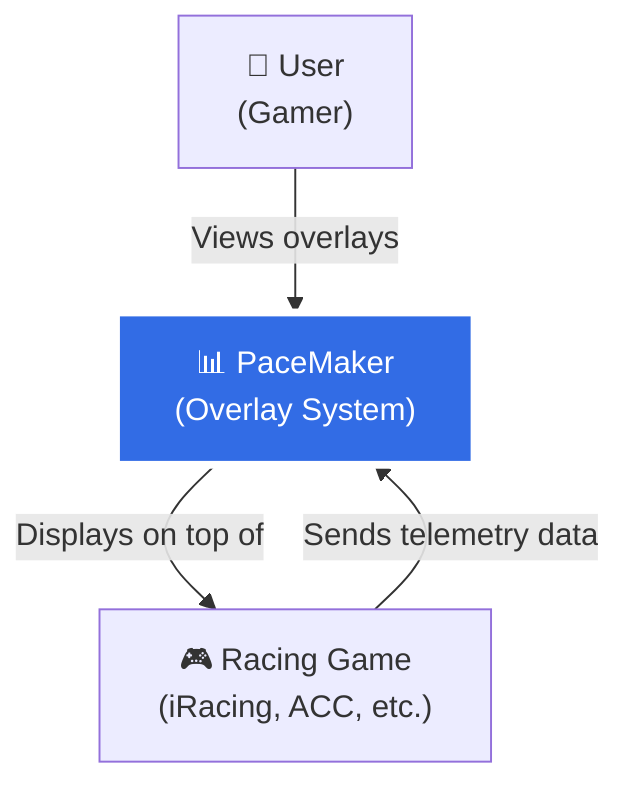
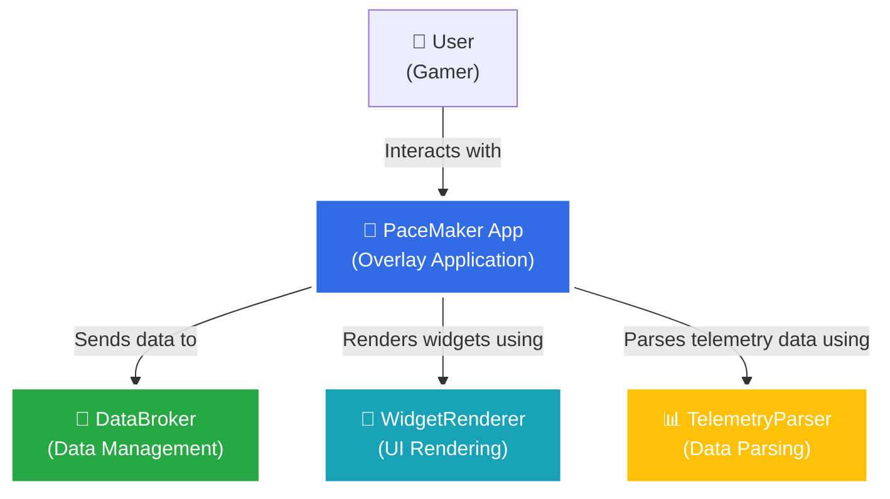
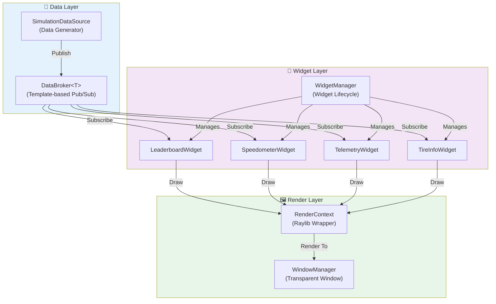
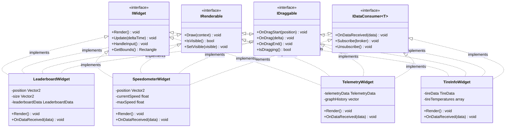
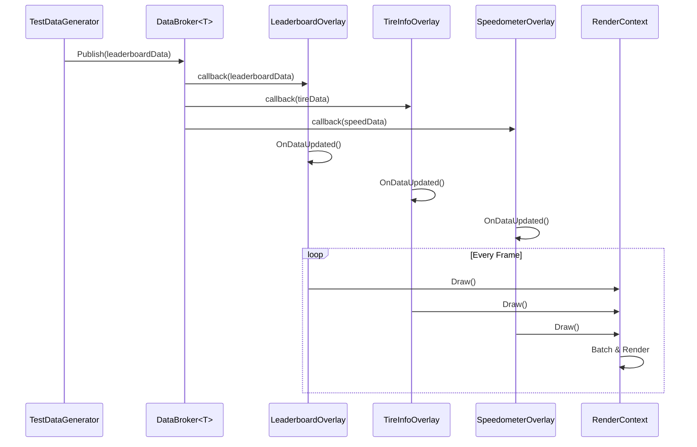
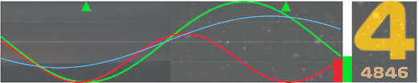
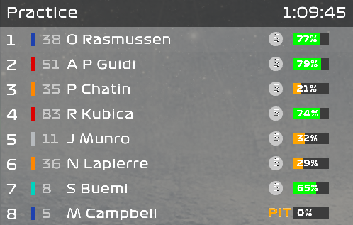
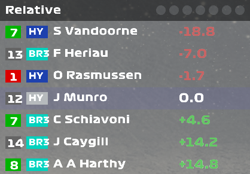
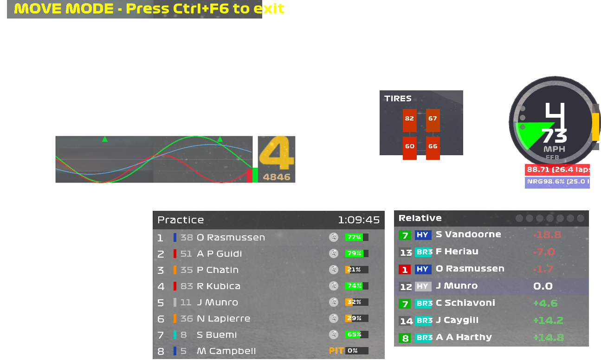

# PaceMaker

A foundational C++20 framework for creating real-time in-game racing overlays using [Raylib](https://www.raylib.com/). PaceMaker provides a flexible widget system with drag-and-drop positioning, real-time data streaming via publish-subscribe pattern, and a collection of pre-built racing telemetry overlays.

## Features

- 🎮 **Real-time Racing Overlays**: Pre-built widgets for leaderboards, telemetry, tire info, and more
- 📡 **Publish-Subscribe Pattern**: Decoupled data flow using type-safe DataBroker system
- 🎨 **Drag & Drop UI**: Interactive widget positioning with resize handles (Ctrl+F6 to toggle)
- 🪟 **Transparent Overlay**: Click-through window that sits on top of games
- 🧩 **Extensible Architecture**: Clean interface-based design for custom overlays
- ⚡ **High Performance**: Built with C++20 and optimized for real-time rendering

---

## Architecture Overview

PaceMaker follows the **C4 Model** (Context, Containers, Components, Code) for clear architectural documentation. The system is designed with three core principles:

1. **Separation of Concerns**: Data, UI, and Rendering layers are completely decoupled
2. **Event-Driven Architecture**: Pub/Sub pattern enables loose coupling between components
3. **Interface-Based Design**: Multiple inheritance of thin interfaces provides flexibility

### System Context

**What it does**: PaceMaker acts as a transparent overlay system that sits on top of racing simulation games, displaying real-time telemetry data through customizable widgets.

**Key Interactions**:
- **User → PaceMaker**: Configures widget positions, toggles visibility, and views real-time data
- **Racing Game → PaceMaker**: Streams telemetry data via UDP, shared memory, or simulation
- **PaceMaker → Racing Game**: Non-intrusive overlay using transparent window with click-through

---

### Containers

**High-Level Components**: The system is divided into four logical containers that work together:

| Container | Technology | Responsibility |
|-----------|-----------|----------------|
| **PaceMaker App** | C++20 + Raylib | Main application loop, window management, input handling |
| **DataBroker** | Template-based Pub/Sub | Type-safe message bus for decoupled data distribution |
| **WidgetRenderer** | Raylib Graphics | Manages widget lifecycle, positioning, and rendering pipeline |
| **TelemetryParser** | Protocol Handlers | Parses and normalizes data from various racing sim APIs |

**Communication Flow**:
- User interactions are processed by PaceMaker App
- Parsed telemetry data flows through DataBroker
- Subscribed widgets receive updates and request rendering
- WidgetRenderer coordinates all visual output

---

### Components

**Internal Architecture**: Breaking down the containers into specific components reveals three distinct layers:

#### 📡 **Data Layer**
Handles all data acquisition, normalization, and distribution:
- **DataBroker<T>**: Generic pub/sub hub with type safety and automatic subscription management
- **SimulationDataSource**: Generates test data or interfaces with real racing sim APIs
- Supports multiple data types: leaderboards, telemetry, tire info, fuel data, etc.

#### 🧩 **Widget Layer**
Manages UI components and their behavior:
- **WidgetManager**: Central registry for all widgets, handles updates and event routing
- **Widget Implementations**: Pre-built overlays (Leaderboard, Speedometer, Telemetry, TireInfo)
- Each widget implements 4 interfaces: `IWidget`, `IRenderable`, `IDraggable`, `IDataConsumer<T>`
- Widgets are self-contained and can be added/removed at runtime

#### 🖼️ **Render Layer**
Provides drawing primitives and window management:
- **RenderContext**: Thin abstraction over Raylib for consistent drawing API
- **WindowManager**: Handles transparent window creation, positioning, and click-through behavior
- Optimized rendering pipeline with dirty-rect tracking for performance

**Component Interactions**:
1. `SimDataSource` publishes typed data to `DataBroker`
2. `DataBroker` notifies all subscribed widgets via callbacks
3. Widgets update internal state and mark themselves dirty
4. `WidgetManager` iterates widgets and calls `Draw()` on dirty ones
5. `RenderContext` batches draw calls and submits to `WindowManager`

---

### Code Structure

**Interface Design Philosophy**: Rather than deep inheritance hierarchies, PaceMaker uses **composition through interfaces**. Each widget implements exactly the interfaces it needs:

| Interface | Purpose | Example Methods |
|-----------|---------|-----------------|
| `IWidget` | Core widget functionality | `Update()`, `Render()`, `GetBounds()` |
| `IRenderable` | Visual representation | `Draw()`, `IsVisible()`, `SetVisible()` |
| `IDraggable` | User interaction | `OnDragStart()`, `OnDrag()`, `OnDragEnd()` |
| `IDataConsumer<T>` | Data subscription | `OnDataReceived()`, `Subscribe()`, `Unsubscribe()` |

**Design Patterns Used**:
- ✅ **Publish-Subscribe**: Decouples data producers from consumers
- ✅ **Observer**: Widgets observe data changes without polling
- ✅ **Composite**: Multiple interface implementation for modular behavior
- ✅ **Template Method**: Common widget lifecycle with customizable hooks
- ✅ **Strategy**: Pluggable rendering and interaction strategies

**Extension Points**: To create a custom widget:
1. Implement required interfaces (`IWidget` is mandatory)
2. Subscribe to `DataBroker<YourDataType>`
3. Override `OnDataReceived()` to handle updates
4. Implement `Draw()` to render your visualization
5. Register with `WidgetManager`

---

### Data Flow

**Real-Time Pipeline**: Data flows through the system in a push-based, event-driven manner:

**Performance Characteristics**:
- **Latency**: < 1ms from data publication to widget callback
- **Throughput**: Handles 100+ updates/second per data type
- **Memory**: Zero-copy data sharing via shared_ptr
- **Threading**: Single-threaded for now, lock-free pub/sub ready for multi-threading

**Data Update Strategy**:
1. External data source (game or simulator) generates telemetry
2. `DataBroker` receives and validates data
3. Callbacks fire synchronously to all subscribers
4. Widgets update internal state immediately
5. Next frame, `Render()` uses latest data

---

## Screenshots
### Inputs Telemetry Overlay

### Leaderboard Overlay

### Relative Timing Overlay

### All Overlays Combined

